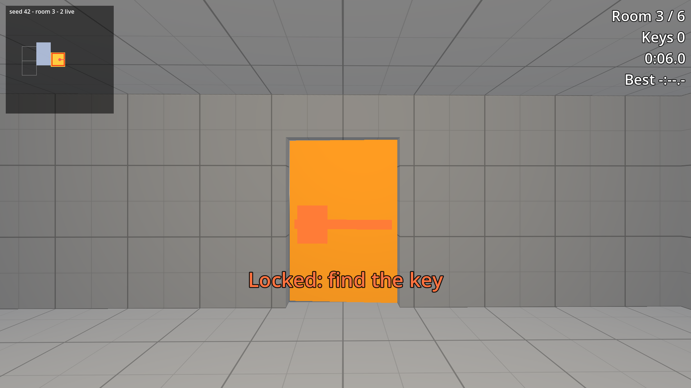

# Keys and Locked Doors in Godot 4

Project files for tutorial 04 of the Godot 4 series by Phaix on YouTube (https://www.youtube.com/@Phaix).

Add keys and locked doors in Godot 4, like Roblox DOORS.
A DOORS-style game where every random level stays solvable.

A key pickup, a locked door that asks the level, key spots on markers with a second seeded generator, a headless check over a thousand seeds, and feedback when a door stays shut. Every step is its own project folder.



## Steps

Every step of the video is its own folder in `steps/`, the exact state at the end of that
part. Open the project in Godot 4.7, then open `steps/<step>/main.tscn` and press F6 to run
that step. The project's main scene is the final step.

| Folder | Part of the video |
|---|---|
| `steps/step_00_start` | Starting point (the final state of tutorial 03) |
| `steps/step_01_key_pickup` | Step 1 - A key to pick up |
| `steps/step_02_locked_door` | Step 2 - A locked door |
| `steps/step_03_key_spots` | Step 3 - Spots for keys |
| `steps/step_04_always_solvable` | Step 4 - Always solvable |
| `steps/step_05_locked_feedback` | Step 5 - Feedback |

## Controls

WASD or arrow keys or the left stick to walk, mouse or right stick to look, Space to jump,
Esc gives the mouse back, a click captures it again. Further keys per tutorial are shown
in the video and in the HUD.

## Tests

```sh
godot --headless --path . -s res://tests/run_tests.gd
```

## Changed since the video

- One fix went into every step folder after the video: the old rooms are now freed when the door behind the player has shut, not when the player enters the next room. Before, you could look back through that door while it was still closing and see a hole where the oldest room had been.
- `door.gd` has a new signal, `closed`, emitted when the door has finished swinging shut (never when it is opened again on the way).
- `level.gd` has a new function, `_on_door_closed(index)`, which frees the rooms behind that door and puts a wall where the doorway of the room just left was. `_spawn_room` connects the signal, and `_on_room_entered` only closes the door behind the player now.
- `tests/run_tests.gd` has a new test, `test_rooms_wait_for_the_door`, and the streaming test expects the rooms to go when the door has shut.
- The code on screen in the video shows the earlier version of these lines.
- The rest is as in the video.

## Support

Support the channel: https://ko-fi.com/phaix or https://github.com/sponsors/schemann

## License

Code and scenes: MIT (see LICENSE).
